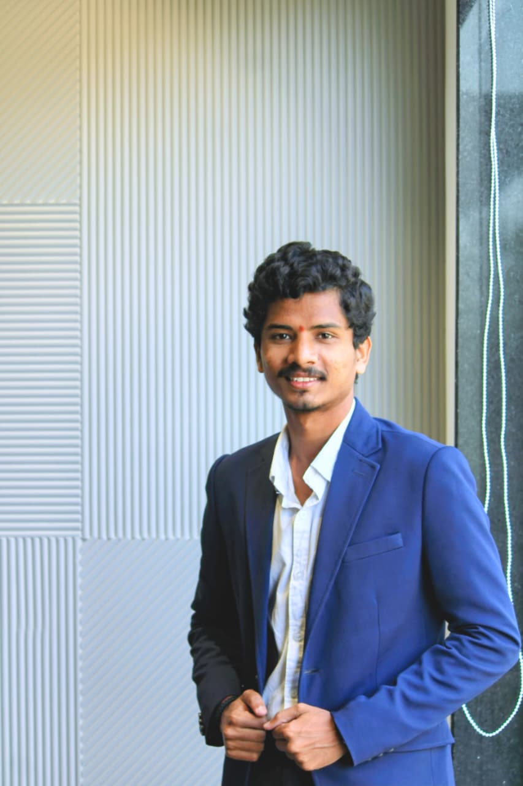

<!-- ===================== HEADER ===================== -->


<!-- ===================== HERO: photo + intro side by side ===================== -->
<table width="100%">
<tr>
<td width="30%" align="center">
  
</td>
<td width="70%">

<h2>Hey, I'm Ram Charan 👋</h2>


<a href="https://linkedin.com/in/cholleti-ram-charan-teja" target="_blank"></a>
<a href="mailto:ramcharancholleti@gmail.com" target="_blank"></a>
<a href="https://github.com/Ramcharan1706" target="_blank"></a>
<a href="https://www.instagram.com/ramcharan_1706" target="_blank"></a>

<br/><br/>


</td>
</tr>
</table>


<!-- ===================== ABOUT ===================== -->
## 🧬 About Me

```yaml
name:       Cholleti Ram Charan Teja
role:       Software Engineer — Full Stack / Systems
education:  B.Tech, AI & ML @ KPRIT, Hyderabad (2024 - 2027)
focus:      low-latency systems, real-time pipelines, clean APIs
highlights:
  - 6+ shipped production projects, 500+ live users
  - 10+ open-source forks across public repos
  - 2x Hackathon Winner (200+ participants)
  - Technical Lead @ KPRIT Blockchain Club
  - 22+ public repositories
currently:  building PitCrew — on-chain DeFi automation
```


<!-- ===================== TECH STACK ===================== -->
## ⚙️ Tech Arsenal

<table width="100%">
<tr>
<td valign="top" width="50%">

**Languages**
<p></p>

**Frontend**
<p></p>

**Backend**
<p></p>

</td>
<td valign="top" width="50%">

**Databases**
<p></p>

**Cloud & Tools**
<p></p>

**Specialized**
<p>

&nbsp;


</p>

</td>
</tr>
</table>


<!-- ===================== PROJECTS ===================== -->
## 🚀 Featured Builds

<table width="100%">
<tr>
<td width="50%" valign="top">


On-chain smart contracts auto-execute conditional trading intents from live price feeds. Node.js + WebSocket backend → sub-second event propagation to a React/TS frontend.

`Node.js` `React` `TypeScript` `WebSocket` `Prisma` `Algorand`

</td>
<td width="50%" valign="top">


PPE-compliance detection with per-worker safety scoring (0–100), timestamped violation logs, and a CSV-driven KPI dashboard.

`Python` `YOLOv8` `OpenCV` `Streamlit`

</td>
</tr>
<tr>
<td width="50%" valign="top">


🏆 **Winner, SmartBridge Hackathon.** LLM-powered app generating learning content in 4 formats — text, code, audio, diagrams. Live on Render.

`Python` `Flask` `Gemini API` `Mermaid.js`

</td>
<td width="50%" valign="top">


Designed & shipped end-to-end, 2 weeks ahead of schedule. 500+ visitors, zero downtime, 35% faster load via optimized Tailwind layouts.

`React` `Tailwind CSS`

</td>
</tr>
</table>


<!-- ===================== EXPERIENCE ===================== -->
## 💼 Experience Timeline

```text
2025 Sep ─┬─ Web Development Lead, TEDxKPRIT
          │  Shipped official event site · 500+ visitors · zero downtime
          │
2025 Dec ─┼─ Web & CMS Dev Intern, GloJourn Immigration (Remote)
   → 2026 │  5+ REST APIs on PostgreSQL · cut case-tracking time by 40%
 Mar      │
2025      ┴─ 🏆 Winner — SmartBridge Hackathon & Innova Blockchain Hackathon
```


<!-- ===================== STATS ===================== -->
## 📊 GitHub Analytics

<p align="center">
  
  
</p>

<p align="center">
  
</p>

<p align="center">
  
</p>


<!-- ===================== SNAKE ===================== -->
## 🐍 Contribution Snake

<p align="center">
  
</p>


<!-- ===================== FOOTER ===================== -->
<p align="center">
  <a href="https://github.com/Ramcharan1706?tab=repositories" target="_blank">
    
  </a>
</p>

<p align="center">
  
</p>


